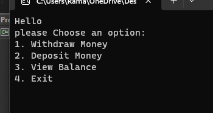

# **Bank ATM**
## What is it ?
+ **BankATM** app is an ATM simulation site that performs simple operations to withdraw money or deposit money to the balance in the ATM.

## What it looks like?
+ It's a simple app just show you options to choose from here is photo show how it looks like:    

## How they use it?
+ First run the program to show the console that display data like the image.
+ Choose from the options what you want.

+ If you choose **First option (Withdraw money)** It will ask the user to enter amount to withdraw then display if it successfully withdrawn or not with the new balance and choose message again.

+ If the user choose the **Second option(Deposit)** it will ask him to enter amount to deposit and display meassage if the deposit done successfully or not with the new balance and the choose message again.

+ If the user choose the **Third option (View Balance)** It will show him the current balance with the choose message again.

+ Finally if the user enter the **Fourth option (Exit)** it show to him Thank you bye bye message.

## Any other details:
+ The user not allowed to enter anegative value for the deposite or the withdraw also he is not allowed to enter a value for the withdraw that is greater then the balance. in all cases the operation not run and the balance never change.